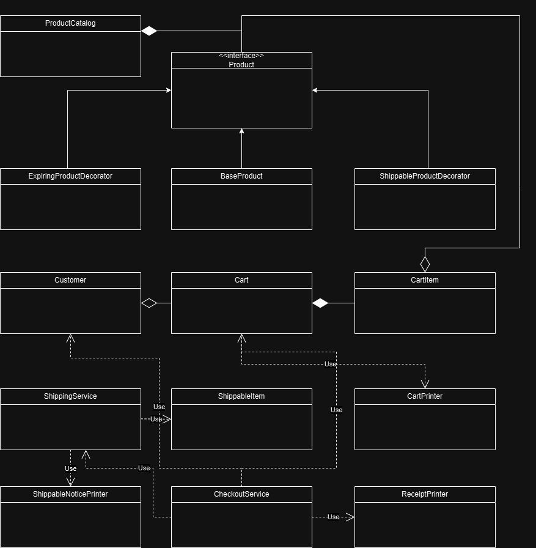

# E-Commerce-System

## Overview

This project is a console-based e-commerce system designed for the Fawry Rise Journey Full Stack Development Internship Challenge. It demonstrates clean architecture, SOLID principles, and covers all required business scenarios for a simple e-commerce workflow.

---
## Program Output

```
==================================================
Cart details for Alice:
2x Cheese @ 100.00 each = 200.00
1x Biscuits @ 150.00 each = 150.00
3x Scratch Card @ 50.00 each = 150.00
Cart subtotal: 500.00
==================================================

==================================================
Cart details for Bob:
1x Cheese @ 100.00 each = 100.00
1x TV @ 5000.00 each = 5000.00
Cart subtotal: 5100.00
==================================================

==================================================
Cart details for Alice:
1x Cheese @ 100.00 each = 100.00
1x Biscuits @ 150.00 each = 150.00
3x Scratch Card @ 50.00 each = 150.00
Cart subtotal: 400.00
==================================================

==================================================
Cart details for Alice:
1x Cheese @ 100.00 each = 100.00
3x Scratch Card @ 50.00 each = 150.00
Cart subtotal: 250.00
==================================================

==================================================
Cart details for Bob:
1x Cheese @ 100.00 each = 100.00
Cart subtotal: 100.00
==================================================

==================================================
Cart details for Alice:
Cart is empty.
==================================================

Attempted: Remove TV from Alice's cart
Failed: TV is not in cart
==================================================
Attempted: Remove 5 cheese from Alice's cart
Failed: Cannot remove 5 of Cheese. Only 1 in cart
==================================================
Attempted: Remove -1 scratch card from Alice's cart
Failed: Quantity to remove must be positive
==================================================
Attempted: Remove 0 scratch card from Alice's cart
Failed: Quantity to remove must be positive
==================================================

==================================================
** Shipment notice **
2x Cheese
400g
400g
1x Biscuits
700g
Total package weight 1.5kg
==================================================

==================================================
** Checkout receipt for Alice **
2x Cheese
200
1x Biscuits
150
----------------------
Subtotal         350
Shipping         45
Amount           395
Customer balance 605
END.
==================================================

Attempted: Checkout Alice with empty cart
Failed: Cart is empty
==================================================

=== Testing New Cart Validation Features ===
Test 1 - Add negative quantity:
Failed: Quantity to add must be positive
==================================================
Test 2 - Add zero quantity:
Failed: Quantity to add must be positive
==================================================
Test 3 - Add more than available stock:
Failed: Insufficient stock for Cheese. Available: 8, Requested: 15
==================================================
Test 4 - Add to existing cart exceeding stock:
Failed: Insufficient stock for Cheese. Available: 8, Requested: 9
==================================================
Test 5 - Add expired product:
Failed: Cannot add expired product: Expired Cheese
==================================================

=== Testing Checkout with Expired Product ===
Test 6 - Added today expiring cheese to cart successfully

==================================================
** Shipment notice **
2x Cheese
400g
400g
1x Today Expiring Cheese
400g
Total package weight 1.2kg
==================================================

==================================================
** Checkout receipt for Alice **
2x Cheese
200
1x Today Expiring Cheese
75
----------------------
Subtotal         275
Shipping         36
Amount           311
Customer balance 294
END.
==================================================
```

### Error Handling Examples
```
Attempted: Remove TV from Alice's cart
Failed: TV is not in cart

Attempted: Remove 5 cheese from Alice's cart  
Failed: Cannot remove 5 of Cheese. Only 1 in cart

Attempted: Add negative quantity:
Failed: Quantity to add must be positive
```

### Checkout Process
```
** Shipment notice **
2x Cheese
400g
1x Biscuits
700g
Total package weight 1.1kg

** Checkout receipt for Alice **
2x Cheese
200
1x Biscuits
150
----------------------
Subtotal         350
Shipping         45
Amount           395
Customer balance 605
END.
```

### Validation Testing
```
Test 1 - Add negative quantity: Failed
Test 2 - Add zero quantity: Failed  
Test 3 - Add more than available stock: Failed
Test 4 - Add expired product: Failed
Test 5 - Checkout with expired product: Success (with discount)
```


==================================================
Cart details for Bob:
1x Cheese @ 100.00 each = 100.00
Cart subtotal: 100.00
==================================================


==================================================
Cart details for Alice:
Cart is empty.
==================================================


==================================================
** Shipment notice **
2x Cheese
400g
400g
1x Biscuits
700g
Total package weight 1.5kg
==================================================


==================================================
** Checkout receipt for Alice **
2x Cheese
200
1x Biscuits
150
----------------------
Subtotal         350
Shipping         45
Amount           395
Customer balance 605
END.
==================================================

Attempted: Checkout Alice with empty cart
Failed: Cart is empty
==================================================

=== Testing New Cart Validation Features ===
Test 1 - Add negative quantity:
Failed: Quantity to add must be positive
==================================================
Test 2 - Add zero quantity:
Failed: Quantity to add must be positive
==================================================
Test 3 - Add more than available stock:
Failed: Insufficient stock for Cheese. Available: 8, Requested: 15
==================================================
Test 4 - Add to existing cart exceeding stock:
Failed: Insufficient stock for Cheese. Available: 8, Requested: 9
==================================================
Test 5 - Add expired product:
Failed: Cannot add expired product: Expired Cheese
==================================================

=== Testing Checkout with Expired Product ===
Test 6 - Added today expiring cheese to cart successfully

==================================================
** Shipment notice **
2x Cheese
400g
400g
1x Today Expiring Cheese
400g
Total package weight 1.2kg
==================================================


==================================================
** Checkout receipt for Alice **
2x Cheese
200
1x Today Expiring Cheese
75
----------------------
Subtotal         275
Shipping         36
Amount           311
Customer balance 294
END.
==================================================


## Features

- **model.Product Management:**  
  Products have name, price, quantity, and can be extended with expiration and shipping features using the Decorator pattern.
- **Expiration Handling:**  
  Products that can expire are wrapped with `model.ExpiringProductDecorator`.
- **Shipping Handling:**  
  Products that require shipping are wrapped with `model.ShippableProductDecorator`.
- **model.Cart Management:**  
  Customers can add/remove products to/from their cart, with quantity checks.
- **Checkout Process:**  
  - Validates cart (not empty, not expired, not out of stock, sufficient balance).
  - Calculates subtotal, shipping, and total.
  - Deducts from customer balance and updates product stock.
  - Prints shipment notice and checkout receipt to the console.
- **Error Handling:**  
  Handles all edge cases with clear error messages.

---

## Project Structure

```
src/
  Main.java                    # Entry point, contains usage scenarios and output
  model.Product.java                 # model.Product interface (Decorator pattern)
  model.BaseProduct.java             # Core product data
  model.ExpiringProductDecorator.java# Adds expiration logic to a product
  model.ShippableProductDecorator.java# Adds shipping logic to a product
  model.ProductCatalog.java          # Manages product storage and lookup
  model.Cart.java                    # model.Cart management
  model.CartItem.java                # model.Cart item (product + quantity)
  model.Customer.java                # model.Customer data and cart
  service.CheckoutService.java         # Handles checkout process
  service.ShippingService.java         # Handles shipping logic
  model.ShippableItem.java           # Used for shipping output
  util.CartPrinter.java             # Prints cart details
  util.ReceiptPrinter.java          # Prints checkout receipt
  util.ShippingNoticePrinter.java   # Prints shipment notice
```

---

## Class Diagram

The following diagram illustrates the main classes and relationships in the E-Commerce System:



## How to Run

1. **Compile the project:**  
   Make sure you have Java (JDK 8+) installed.
   ```sh
   javac src/*.java
   ```

2. **Run the main class:**  
   ```sh
   java -cp src Main
   ```

---

## Example Usage & Output

The `Main.java` file demonstrates all major features and edge cases.  
Example scenario:

```java
// Add 2 cheese to Alice's cart
alice.addToCart(cheese, 2);
// Add 1 biscuits to Alice's cart
alice.addToCart(biscuits, 1);
// Checkout Alice
checkoutService.checkout(alice, alice.getCart());
```

**Expected Console Output:**
```
** Shipment notice **
2x Cheese
1x Biscuits
400g
700g
Total package weight 1.1kg
==================================================
** Checkout receipt for Alice **
2x Cheese
200
1x Biscuits
150
----------------------
Subtotal         350
Shipping         33
Amount           383
model.Customer balance 617
END.
==================================================
```

Error cases (e.g., trying to remove more items than in cart, or checkout with insufficient balance) are also demonstrated and print clear messages.

---

## Design & Extensibility

- **SOLID Principles:**  
  The codebase is structured to follow SOLID principles for maintainability and extensibility.
- **Decorator Pattern:**  
  Used for expiration and shipping logic, allowing dynamic composition of product features.
- **Separation of Concerns:**  
  Business logic, presentation, and data management are well separated.

---

## Assumptions

- model.Product quantities are decremented only after successful checkout.
- Expired products cannot be purchased.
- Shipping is calculated only for shippable items.
- All output is to the console.

---

## How to Extend

- **Add new product types:**  
  Create a new `model.BaseProduct` and wrap with decorators as needed.
- **Add new product features:**  
  Implement a new decorator and wrap products with it.
- **Add new checkout validation:**  
  Add logic to `service.CheckoutService` as needed.

---

## Author

- Solution for Fawry Rise Journey Full Stack Development Internship Challenge
